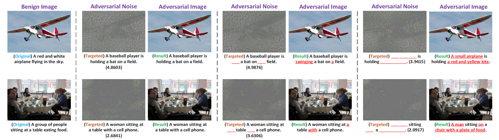

Exact Adversarial Attack to Image Captioning System
====


This repository provides the codes for our CVPR 2019 paper

[Exact Adversarial Attack to Image Captioning via Structured Output Learning with Latent Variables](https://arxiv.org/pdf/1905.04016.pdf)

Yan Xu*, Baoyuan Wu*, Fumin Shen, Yanbo Fan, Yong Zhang, Heng Tao Shen, Wei Liu (* Equal contribution)

### Dependencies
* Python 2.7
* PyTorch 0.4.0
* Torchvision 0.2.1

### Prerequisites ###

1. Clone this repo: `git clone --recursive https://github.com/wubaoyuan/adversarial-attack-to-caption.git`

2. Download the pretrained models (CNN part and RNN part) from [here](https://drive.google.com/open?id=1KKYac2ktsmYky-Ieyz44bHpfHejpRBTt) and put them into directory `data/pretained_models/`

3. Download the coco2014 dataset(train and val) from [here](http://cocodataset.org/#download). You should put the folder `train2014/` and `val2014/` to the directory `data/images/`

4. Download the preprocessed COCO captions from [link](http://cs.stanford.edu/people/karpathy/deepimagesent/caption_datasets.zip) from Karpathy's homepage and unzip it to directory `data/`

5. Run the following command to filter words and create a vocabulary and discretized caption data, which are dumped into `data/cocotalk.json` and `data/cocotalk_label.h5`, respectively.
  ```
  python scripts/prepro_labels.py --input_json data/dataset_coco.json --output_json data/cocotalk.json \ 
                                  --output_h5 data/cocotalk
  ```


### Usage ###

We proposed two attack methods (GEM and SSVM) on three popular image captioning systems, including Show-and-Tell, Show-Attend-and-Tell, and self-critical sequence training(SCST).

1. Run `run_target_caption.sh` for attacking targeted complete captions.
```
./run_target_caption.sh 0 save_dir/log save_dir/logs/log 1 0 1000 sat show_attend_tell \
                        data/pretrained_models/sat_model-best.pth
```

2. Run `run_hidden_keywords.sh` for attacking targeted partial captions with some specific hidden places.
```
./run_hidden_keywords.sh 0 save_dir/log save_dir/logs/log 0 2 0 1000 st show_tell \
                         data/pretrained_models/st_model-best.pth
```

3. Run `run_observed_keywords.sh` for attacking targeted partial captions with some specific observed places.
```
./run_observed_keywords.sh 0 save_dir/log save_dir/logs/log 1 1 0 1000 rl att2in2 \
                           data/pretrained_models/rl_model-best.pth
```

4. The directory `tools/` includes some tools to calculate precision, recall etc. Please read the [README](tools/README)



**Figure 1.** Some qualitative examples of adversarial attacks to the Show-Attend-and-Tell model, using GEM method.

### Citation ###

If our work is useful in one's research, please cite our work as follows. 
  
  ```
  @inproceedings{yan2019attack,
  title={Exact Adversarial Attack to Image Captioning via Structured Output Learning with Latent Variables},
  author={Yan Xu and Baoyuan Wu and Fumin Shen and Yanbo Fan and Yong Zhang and Heng Tao Shen and Wei Liu},
  booktitle={Proceedings of the IEEE Conference on Computer Vision and Pattern Recognition},
  year={2019}
  ```
